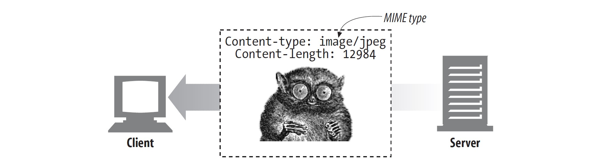

# 媒体类型

因为因特网上托管了数千种不同的数据类型，所以 HTTP 会使用一种数据格式标签为传输的每一个对象仔细做标记，这就是 **MIME (Multipurpose Internet Mail Extensions)**。它起初是为了解决不同电子邮件系统之间传输消息遇到的问题而设计的。因为在电子邮件中使用得非常好，以至于 HTTP 直接采用了它以为自己的多媒体内容进行描述和标记。

Web 服务器会为所有的 HTTP 数据对象附加一个 MIME 类型。当 Web 浏览器从服务器获取到一个对象之后，它将会查看与之关联的 MIME 类型以便知道如何处理此对象。大多数浏览器能够处理上百种流行的对象类型：展示图片文件，解析并格式化 HTML 文件，通过计算机扬声器播放音频文件，或启动外部插件软件来处理特殊的格式。

MIME 类型是一个文本标签，由一个基本的对象类型和一个具体的子类型表示，之间使用一个斜线 (`/`) 分隔。举个例子：

- `text/html`：HTML 文本文档。
- `text/plain`：普通的 ASCII 文本文档。
- `image/jpeg`：JPEG 图片。
- `image/gif`：GIF 图片。
- `video/quicktime`：Apple QuickTime 视频。
- `application/vnd.ms-powerpoint`：Microsoft PowerPoint 幻灯片。

有上百种流行的 MIME 类型，并且还有很多试验性或受限使用的类型。

## MIME 类型表格

### application/* 应用相关内容格式（独立类型）

### audio/* 音频格式（独立类型）

### chemical/* Chemical 数据集（独立类型）

### image/* 图片格式（独立类型）

### message/* 消息格式（独立类型）

### model/* 3-D 模型格式（独立类型）

### multipart/* 多种对象集合（组合类型）

### text/* 文本格式（独立类型）

### video/* 视频格式（独立类型）
