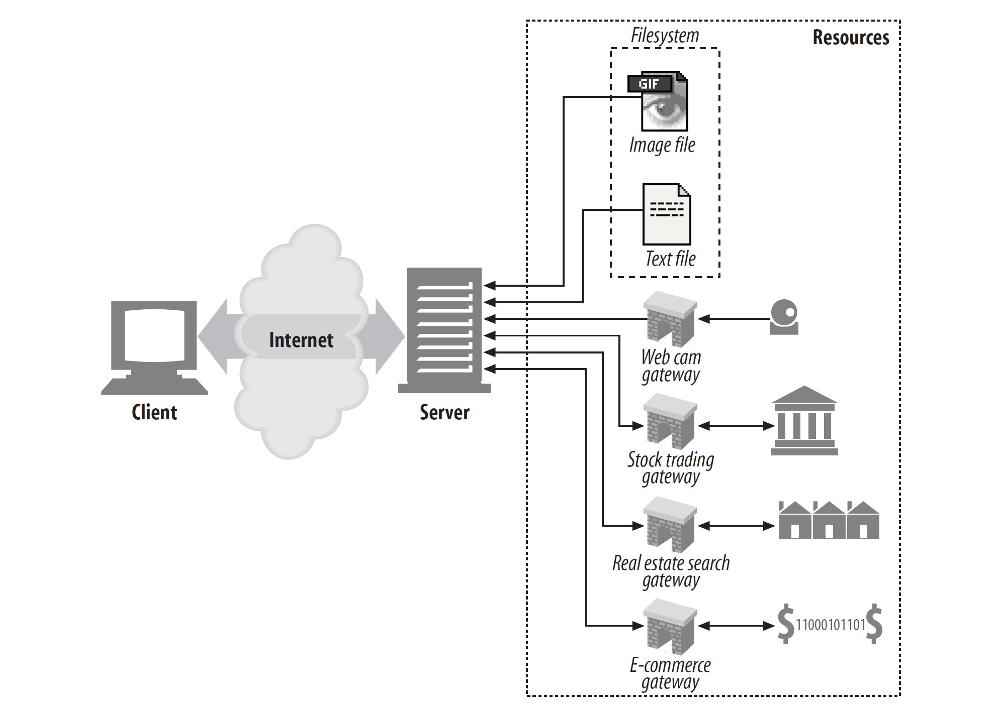

# 资源

**Web 资源** 由 Web 服务器托管。Web 资源就是 Web 内容的数据源。最简单的 Web 资源就是 Web 服务器文件系统中存储的静态文件。这些文件可以包含任意东西：文本文件，HTML 文件，Microsoft Word 文件，Adobe Acrobat 文件，JPEG 图像文件，AVI 影视文件，或者您能想到的任意格式的文件。

然而，资源不限于静态文件。它可以是软件程序按需生成的内容。这些动态内容资源可以基于您的身份，请求的信息，或者日期等条件生成。可以给您展示来自相机中的动态图片，供您进行股票交易，让您搜索地产数据库，或者在网上商店买礼物。
